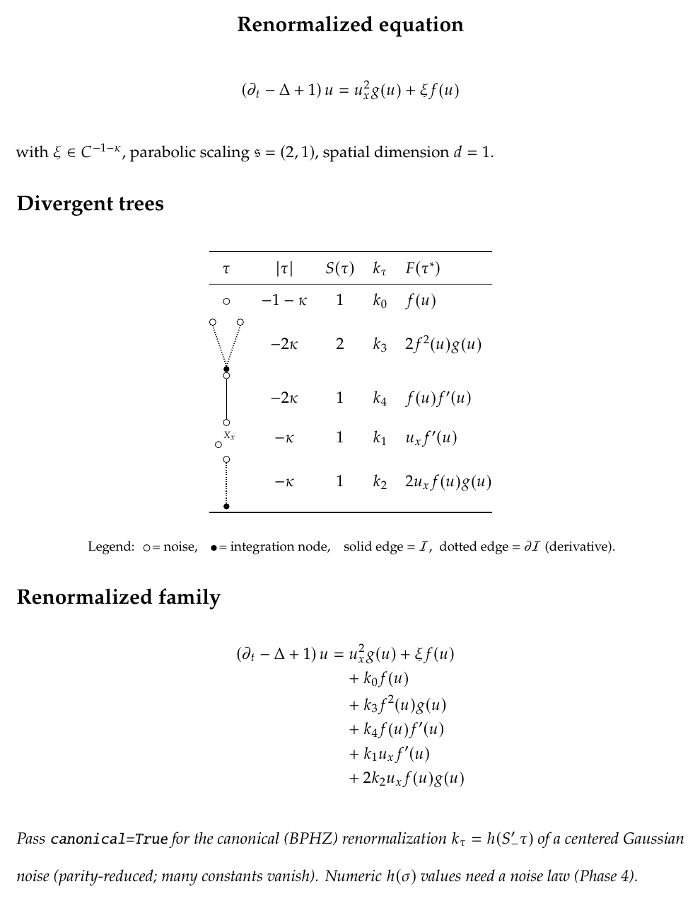

# counterterms

Symbolic **renormalization of singular SPDEs**, following Bailleul & Hoshino,
*"A tourist's guide to regularity structures and singular stochastic PDEs"*
([arXiv:2006.03524](https://arxiv.org/abs/2006.03524)).

> ⚠️ **Personal research library — no guarantees.** This is a one-person research project,
> not production software. It's validated against the paper where it can be (see [Validation](#validation)),
> but it may well be wrong, incomplete, or break on inputs it hasn't seen. No warranty, no
> stability promises, no support. Check the output against the mathematics before you trust it.

You give it a subcritical singular SPDE; it gives you the **family of renormalized equations**
(the BCCH / `ThmRenormPDEs` formula) — the original PDE plus one tree-indexed counterterm per
negative-homogeneity decorated tree, with free renormalization constants:

$$(\partial_t - \Delta + 1) u^{(k)} = f(u^{(k)}) \zeta + g(u^{(k)}, \partial u^{(k)}) + \sum_{\tau \in \mathcal{B}, |\tau| < 0} \frac{k_\tau}{S(\tau)} F(\tau^*)(u^{(k)}, \partial u^{(k)})$$

— and, underneath, the full algebraic machinery (the regularity structure $(T, T^+)$, the
extraction/recentering coproducts, the twisted antipode, the BHZ character, the renormalization
group $G^-$).

**It is a *symbolic* engine.** It computes *what* to renormalize and the *structure* of the
renormalization. It does **not** compute the *numeric* values of the constants (those need
Gaussian/Wick integrals — out of scope), nor analytic estimates, convergence, or a solver.

## Install & test

[`uv`](https://docs.astral.sh/uv/); SymPy is the only runtime dependency.

```sh
uv sync
uv run pytest          # 176 tests, ~5s
```

## 30-second quickstart

```python
from sympy import Derivative, Function, Rational
from counterterms import SPDE, Noise, Parabolic, Unknown, kappa

u  = Unknown("u", dim=1)
xi = Noise("xi", regularity=Rational(-1) - kappa)              # noise regularity -1 - kappa
f, g = Function("f"), Function("g")

spde = SPDE(operator=Parabolic(dim=1, mass=1), unknown=u, noises=[xi],
            rhs=f(u.field) * xi.symbol + g(u.field) * Derivative(u.field, u.x[0])**2)

print(spde.renormalize().summary())     # the five gKPZ counterterms
```

More in [`examples/`](examples/) (`uv run python -u examples/01_renormalized_equation.py`).

The same `spde` also yields the **canonical (BPHZ) character** — the symbolic constant
$k_\tau = h(S'_- \tau)$ the twisted antipode prescribes, with the Gaussian parity rule applied
(odd-noise trees vanish). The $h$-values stay free symbols; their numeric (Wick-integral)
values are out of scope.

```python
from counterterms import build_renormalization

rs = build_renormalization(spde)
for t in rs.divergent:
    print(rs.canonical_character(t))   # exact antipode combo in h-values; odd-noise tau -> 0
```

## Example output

`eq.save()` writes the report as text / Markdown / JSON and a typeset LaTeX → PDF. Here is the
PDF for the gKPZ equation above — the parsed equation, every divergent tree $\tau$ (drawn in the
paper's convention: $\circ$ noise, $\bullet$ integration node, dotted = derivative kernel) with its
homogeneity $|\tau|$, symmetry factor $S(\tau)$, free constant $k_\tau$ and elementary differential
$F(\tau^*)$, and the assembled renormalized family:



*(rendered from [`docs/example_gkpz.pdf`](docs/example_gkpz.pdf); `canonical=True` adds the
BPHZ section $k_\tau = h(S'_-\tau)$ with the parity-vanishing constants.)*

## What you can do — and which module handles it

Everything public is re-exported from the top-level `counterterms` package.

### Input & the renormalized equation
| You want… | Call | Module |
|---|---|---|
| Write the SPDE (DSL) | `Unknown`, `Noise`, `Parabolic`, `SPDE` | `equation/dsl.py` |
| Derive the renormalized family | `SPDE(...).renormalize()` → `RenormalizedEquation` | `api.py`, `renorm/equation.py` |
| Access each counterterm (tree, $\lvert\tau\rvert$, $S(\tau)$, $F(\tau^*)$, $k_\tau$) | `eq.counterterms`, `eq.per_component` | `renorm/equation.py` |
| Render the report (text / markdown / json / latex) | `eq.summary()`, `eq.render(fmt)`, `eq.save()` | `render/report.py`, `render/latex.py` |
| **$\Phi^4_2 / \Phi^4_3$** (supercritical, $\beta_0 \le -\text{order}$) | `daprato_lift(spde).renormalize()` | `equation/daprato.py` |

### The trees and the rule
| You want… | Call | Module |
|---|---|---|
| The divergent trees $\mathcal{B}_{<0}$ | `generate_counterterms(sig)` | `equation/generate.py` |
| The structural rule from the nonlinearity | `build_context(spde)` → `(sig, base, unknowns)` | `equation/dsl.py` |
| Subcriticality check ($\beta_0 > -\text{order}$) | `check_subcritical(sig)` (auto in `build_context`) | `equation/rule.py` |
| Decorated trees: canonical form, $S(\tau)$, homogeneity | `DecoratedTree`, `tree`, `red_node` | `trees/tree.py` |
| The elementary differential $F(\tau^*)$ ($\Upsilon$-map) | `elem_diff(t, comp, base, sig)` | `renorm/nonlinearity.py` |
| Draw a single tree (shorthand / ascii / `forest`) | `shorthand`, `ascii_art`, `forest` | `render/tree.py` |

### The algebraic structure (regularity structure & renormalization)
| You want… | Call | Module |
|---|---|---|
| The regularity structure $(T, T^+)$, graded basis | `build_regularity_structure(spde)` | `structures.py` |
| Recentering $\Delta : T \to T \otimes T^+$, structure coproduct $\Delta^+$ | `delta_plus(t, sig[, project_left])` | `trees/coproducts.py` |
| Extraction–contraction $\delta$ / $\delta^-$ (and the cointeraction) | `delta_minus`, `delta_minus_group` | `trees/coproducts.py` |
| Negative twisted antipode $S'_-$ | `twisted_antipode(t, sig)` | `trees/coproducts.py` |
| Renormalization structure + symbolic **BHZ character** $k = h \circ S'_-$ | `build_renormalization(spde)` → `.bhz_character`, `.canonical_character` | `structures.py` |
| The renormalization **group** $G^-$ (convolution, antipode inverse) | `build_renormalization_group(spde)` | `structures.py` |
| Generic, basis-agnostic Hopf ops (convolve / antipode / comodule) | `convolve`, `antipode`, `comodule_action` | `core/hopf.py` |
| Canonical (BPHZ) constants — Wick pairings & parity (symbolic) | `expectation`, `NoiseLaw`, `BPHZ`, `FreeConstants` | `renorm/scheme.py` |
| Machine-readable export of the whole structure (JSON) | `structure_json(spde)`, `export_structure`, `tree_to_dict` | `render/export.py` |

### Foundations
| You want… | Call | Module |
|---|---|---|
| The ordered homogeneity ring $\mathbb{Q} \oplus \mathbb{Q}\cdot\kappa$ | `Homogeneity`, `kappa`, `Scaling` | `core/homogeneity.py` |
| Jet variables $u^c_k$ | `jet`, `is_jet`, `jet_parts` | `core/jets.py` |
| The `Signature` (the parametric vocabulary everything threads) | `Signature` | `core/signature.py` |
| The `Symbol` protocol (basis seam) | `Symbol` | `core/symbol.py` |

## Scope

**In scope:** scalar **or coupled systems**, single **or multiple** noises, 2nd-order parabolic
$L$ (general operator order with a warning), $\beta_0 > -\text{order}$ (rule-based subcriticality), $g$ at most
quadratic in $\partial u$ (Assumption D2), $\lvert p\rvert_\mathfrak{s} \le 1$. Covers **gKPZ, KPZ, gPAM, PAM, coupled systems,
multi-noise**, and — via `daprato_lift` — **$\Phi^4_2$, $\Phi^4_3$**.

**Rejected with clear errors:** non-polynomial supercritical equations (sine-Gordon needs Wick
exponentials), noise nonlinearities not affine in the noise, $g$ more than quadratic in $\partial u$,
singular derivative factors $\lvert p\rvert_\mathfrak{s} > 1$, quasilinear / non-parabolic operators.

## What it does *not* do (the analysis/probability wall)

No **numeric** renormalization constants (no Gaussian/Wick integrals — `renorm/scheme.py`
gives the symbolic Wick-pairing structure and the parity rule, but not the divergent integrals);
no model construction, analytic estimates, convergence, or solving. The free constants $k_\tau$ are
the *complete* symbolic answer — a solution to a singular SPDE *is* the family indexed by the
renormalization group. See [`notes/use_cases.md`](notes/use_cases.md) and
[`notes/phase4_plan.md`](notes/phase4_plan.md).

## Status

Phases 1–3 complete and green; Phase 4 partially built.

- **Phase 1–2** — the renormalized family from an `SPDE`, for scalar/systems, one/many noises, operator order.
- **Phase 3** — coproducts (the cointeraction holds **including $\beta_0 = -3/2$**), `RegularityStructure` $(T, T^+)$,
  the generic `core/hopf` layer, subcriticality, twisted antipode + BHZ character, the group $G^-$.
- **Phase 4 (partial)** — `daprato_lift` ($\Phi^4_{2/3}$), the canonical-character *symbolic* half + Wick
  parity, the full-structure JSON export, and the seams (sockets) for the unbuilt analytic pieces.

See [`ROADMAP.md`](ROADMAP.md) and [`CHANGELOG.md`](CHANGELOG.md).

## Validation

The paper is the only oracle (no reference implementation exists). The suite reproduces the gKPZ
example's exact five counterterms ($\beta_0 = -1$) **and the full strongly-conforming-tree table at
$\beta_0 = -3/2$ (43 trees, tex 6024–6163)** — matching the latter caught and fixed a real tree-generation
bug. Plus an independent symmetry-factor cross-check and benchmark counts. See
[`notes/validation.md`](notes/validation.md).

## Documentation

- [`examples/`](examples/) — runnable quickstart scripts (start here).
- [`ENTRYPOINTS.md`](ENTRYPOINTS.md) — a guided reading order through the source.
- [`notes/use_cases.md`](notes/use_cases.md) — what it can and cannot solve, honestly.
- [`notes/initial_plan.md`](notes/initial_plan.md) — the mathematics (pipeline, conventions, scope).
- [`notes/architecture.md`](notes/architecture.md) — the module structure and design.
- [`notes/cointeraction_singular_noise.md`](notes/cointeraction_singular_noise.md),
  [`notes/phase4_plan.md`](notes/phase4_plan.md), [`notes/validation.md`](notes/validation.md) — deep dives.
- [`references/`](references/) — pointer to the source paper ([arXiv:2006.03524](https://arxiv.org/abs/2006.03524)), cited by line number throughout.

## License

[MIT](LICENSE) © 2026 Pavel Ievlev. The Bailleul–Hoshino paper is *not* included (it is the
authors' copyright) — see [`references/`](references/) for the arXiv link.
